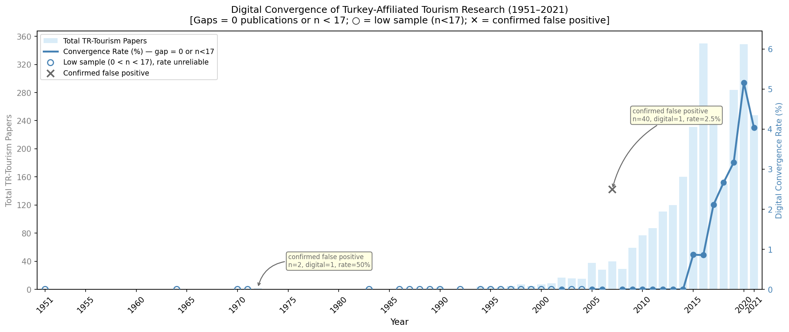
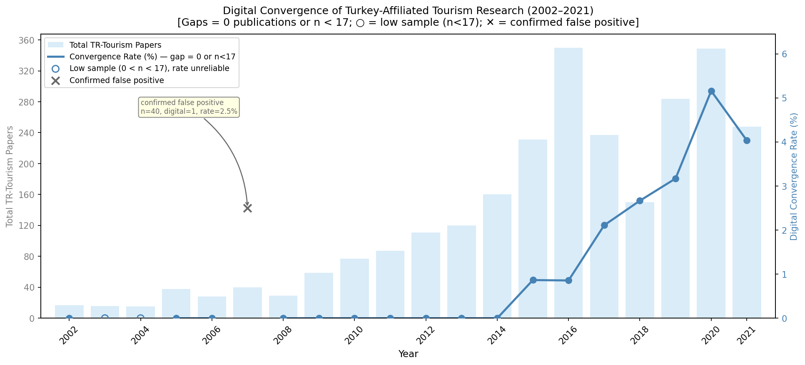

# Digital Convergence of Turkey-Affiliated Tourism Research

> Replication code and outputs for the paper submitted to the  
> **13th International Management Information Systems Conference (IMISC 2026)**  
> October 22–24, 2026 — Mersin University, Türkiye

---

## Research Question

To what extent has Turkey-affiliated tourism research converged with digital and smart technology themes over the period 2002 to 2021, and how has this convergence evolved over time?

---

## Data Source

**Microsoft Academic Graph (MAG)** — [Zenodo dataset](https://zenodo.org/records/6511057)

| File | Size | Description |
|------|------|-------------|
| `Papers.txt` | ~75.5 GB | Paper metadata (ID, normalized title, year) |
| `PaperAuthorAffiliations.txt` | ~54.2 GB | Paper–author–affiliation links |
| `Affiliations.txt` | ~5.4 MB | Affiliation metadata incl. ISO 3166 country code |

> Raw MAG files are not included in this repository due to size. Download from the link above and place under `C:\Users\...\Downloads\6511057\` (or update `DATA_DIR` in the scripts).

---

## Methodology

### Join Chain
```
Affiliations.txt  (Iso3166Code == "TR")
    → TR_affiliation_ids  (set)
    → PaperAuthorAffiliations.txt  filter by TR_affiliation_ids
    → TR_paper_ids  (set)
    → Papers.txt  filter by TR_paper_ids  +  tourism keyword match
    → tourism_papers  →  digital/smart keyword classification
```

### Tourism Keywords
`tourism`, `tourist`, `hospitality`, `hotel`, `resort`, `ecotourism`, `gastronomy`, `smart tourism`, `e-tourism`, `heritage tourism`, `cultural tourism`, `sightseeing`, `leisure`, `tourist destination`, `travel destination`, `travel agency`, `air travel`, `turizm`, `turistik`, `otel`, `konaklama`, `tatil`, `seyahat`, `destinasyon`, `misafirperverlik`, `ekoturizm`, `kaplıca`, `gastronomi`, `kültür turizm`, `kültürel turizm`, `sağlık turizm`, `kongre turizm`, `kırsal turizm`, `termal turizm`, `kruvaziyer`, `tur operatör`, `seyahat acenta`

### Digital / Smart Keywords
`digital`, `smart`, `artificial intelligence`, `machine learning`, `data-driven`, `big data`, `internet of things`, `algorithm`, `deep learning`, `blockchain`, `chatbot`, `automation`, `data mining`, `cloud computing`, `recommendation system`, `virtual reality`, `augmented reality`, `industry 4.0`, `metaverse`, `sensor`, `" ai "`, `" iot "`, `dijital`, `akıllı`, `yapay zeka`, `makine öğrenmesi`, `derin öğrenme`, `veri odaklı`, `büyük veri`, `nesnelerin interneti`, `algoritma`, `veri madenciliği`, `bulut bilişim`, `otomasyon`, `sanal gerçeklik`, `artırılmış gerçeklik`, `endüstri 4.0`, `sensör`

> `" ai "` and `" iot "` are matched with surrounding spaces to avoid false positives (e.g. *"br**ai**n"*, *"terr**ain**"*).

---

## Repository Structure

```
konferans_kodları/
│
├── mersin_conferance1.py            # Main pipeline (Steps 1–7)
├── mersin_conferance2.py            # Filtered analysis 2002–2021 (Step 8)
├── mersin_conferance3.py            # Enhanced visual 1951–2021 (Step 9)
├── mersin_conferance4.py            # Enhanced visual 2002–2021 (Step 10)
│
├── 1.çalıştırma_outputları/
│   ├── digital_convergence_data.csv          # Annual totals (full year range)
│   ├── digital_convergence_table.txt         # Formatted table (full range)
│   ├── digital_convergence_trend.png         # Trend chart (full range)
│   ├── matched_titles.txt                    # All matched tourism paper titles (TSV)
│   ├── sample_titles.txt                     # Random sample for manual validation
│   └── output_log.txt                        # Full run log
│
├── 2.çalıştırma_outputları/
│   ├── digital_convergence_table_2002_2021.txt   # Filtered table (2002–2021)
│   ├── digital_convergence_trend_2002_2021.png   # Trend chart + linear regression
│   └── output_log_step8.txt
│
├── 3.çalıştırma_outputları/
│   └── digital_convergence_trend_1951_2021_gapped.png
│      # Gapped chart: n<17 and confirmed false-positive years excluded from connected line
│
└── 4.çalıştırma_outputları/
    └── digital_convergence_trend_2002_2021_gapped.png
       # Gapped chart: same criteria, focused 2002–2021 window
```

---

## Key Results (2002–2021)

| Year | TR-Tourism Papers | Digital/Smart | Convergence % |
|------|:-----------------:|:-------------:|:-------------:|
| 2015 | 231 | 2 | 0.87% |
| 2016 | 350 | 3 | 0.86% |
| 2017 | 237 | 5 | 2.11% |
| 2018 | 150 | 4 | 2.67% |
| 2019 | 284 | 9 | 3.17% |
| 2020 | 349 | 18 | 5.16% |
| 2021 | 248 | 10 | 4.03% |

Linear trend (2002–2021): **+0.20 percentage points / year**


Enhanced visuals:





---

## How to Reproduce

```bash
# 1. Install dependencies
pip install pandas matplotlib numpy

# 2. Run main pipeline (reads MAG files, ~15–25 min on SSD)
python mersin_conferance1.py

# 3. Run filtered analysis (reads CSV output, < 5 sec)
python mersin_conferance2.py

# 4. Run enhanced long-range gapped visual (1951–2021)
python mersin_conferance3.py

# 5. Run enhanced focused gapped visual (2002–2021)
python mersin_conferance4.py
```

---

## Technical Notes

- Python 3.14 · pandas chunk-based reading (`chunksize=500_000`)
- `SAMPLE_MODE = True` / `SAMPLE_ROWS = 5_000_000` for quick testing
- All progress logged to `output_log.txt` via `_Tee` (stdout + file simultaneously)
- `matched_titles.txt` contains all matched titles for manual false-positive validation
- In enhanced charts, connected convergence line is drawn only for years with n >= 17 and not in confirmed false-positive years
